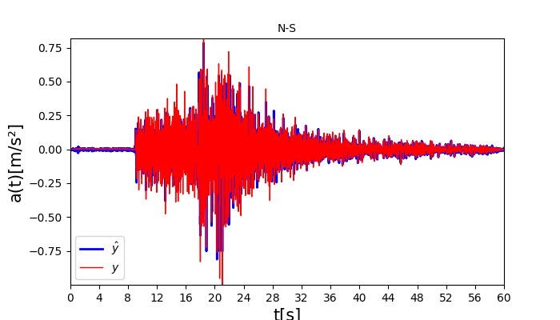
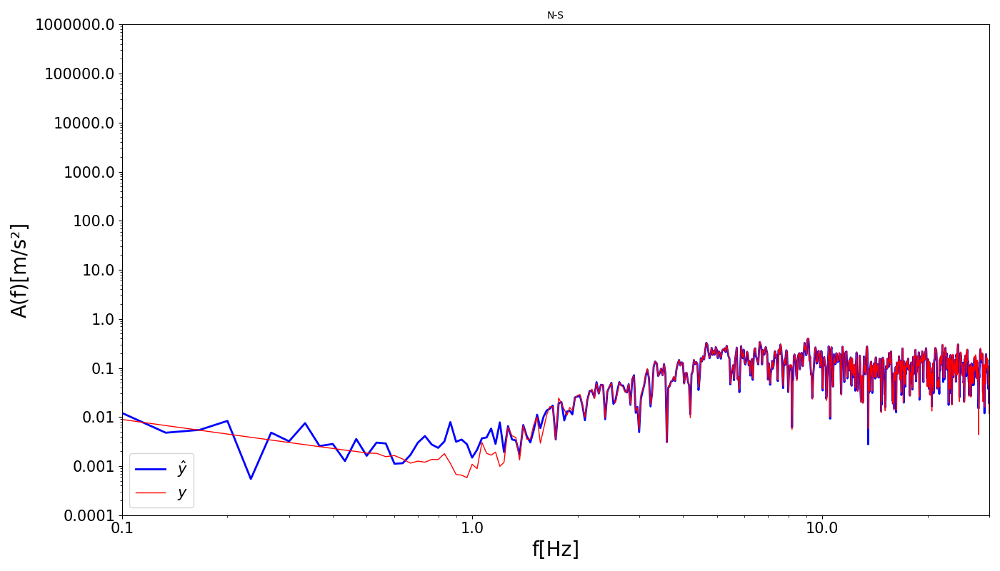

# STEAD_Diffusion

## Overview

This project implements a diffusion model for generating synthetic seismic signals using the STEAD (STanford EArthquake Dataset). The model is designed to learn the underlying distribution of earthquake waveforms and generate realistic synthetic seismic data for various applications in seismology and machine learning.

### Key Features

- **Diffusion-based Generation**: Uses state-of-the-art diffusion models to generate high-quality synthetic seismic waveforms
- **Conditional and Unconditional Models**: Supports both conditional generation (with low-frequency conditioning) and unconditional generation
- **STEAD Dataset Integration**: Specifically designed to work with the STEAD dataset format, including data preprocessing pipelines
- **Comprehensive Processing Pipeline**: Includes tools for converting HDF5 data to PyTorch format, calculating corner frequencies, and data cleaning

### Model Architecture

The core model is based on a 1D U-Net architecture with attention mechanisms, specifically designed for seismic signal generation. The project includes:

- **AttUnet1DCond**: Conditional diffusion model with corner frequency conditioning found in [`diffusion_model.py`](./diffusion/diffusion_model.py)
- **Dual-branch Architecture**: Experimental approach using separate encoding branches for high-pass and low-pass filtered components found in [`db_model.py`](./extra/db_model.py)

### Project Structure

- **`diffusion/`**: Core diffusion model implementation, generation scripts, and utilities
- **`training/`**: Training scripts and trainer classes
- **`STEAD_processing/`**: Data preprocessing notebooks for converting STEAD data to PyTorch format
- **`processing/`**: Data loading and augmentation utilities
- **`common/`**: Shared utilities and helper functions
- **`extra/`**: Experimental dual-branch model implementation
- **`checkpoints/`**: Pre-trained model weights storage

### Applications

This project can be used for:
- Generating synthetic seismic data for data augmentation
- Creating training datasets for earthquake detection models
- Studying seismic signal characteristics and patterns
- Developing and testing seismic analysis algorithms

## Credits
This repository is a variation of https://github.com/HugoGabrielidis16/STEAD_Diffusion, developed by Hugo Gabrielidis, Université Paris-Saclay, CentraleSupélec, CNRS, ENS; Laboratoire de Mécanique Paris-Saclay UMR 9026

## Dataset
You can download the dataset and the model checkpoints at the following [Google Drive](https://drive.google.com/drive/folders/1ciVg-RmA0vIddHeFd3rlouY7UUrr7d51?usp=share_link)

The files should be placed as follow : 
- STEAD_DATA/chunk2/chunk2_130k_fc_no_nan.pt 
- STEAD_DATA/chunk2/chunk2_130k_acceleration_no_nan.pt 
- checkpoints/checkpoint_of_choice.pth  

## Instructions to run
After cloning the repository, run the following command inside the repository folder to be able to execute all python scripts:

    export PYTHONPATH=$(pwd)
    
    pip install -r requirements.txt

To execute a training of the model edit `STEAD_config` in [`parsing.py`](./parsing/parsing.py) to select the model path, number of epochs, batch size, conditioning and other configuration parameters. Then in the main directory run:

    python training/train.py

To generate synthetic seismic signals starting from the true ones edit [`generate_diffusion.py`](./diffusion/generate_diffusion.py) in order to select conditional or uncoditional training, model checkpoint, the number of steps and the $\eta$ parameter. Then in the main directory run:

    python diffusion/generate_diffusion.py

    
